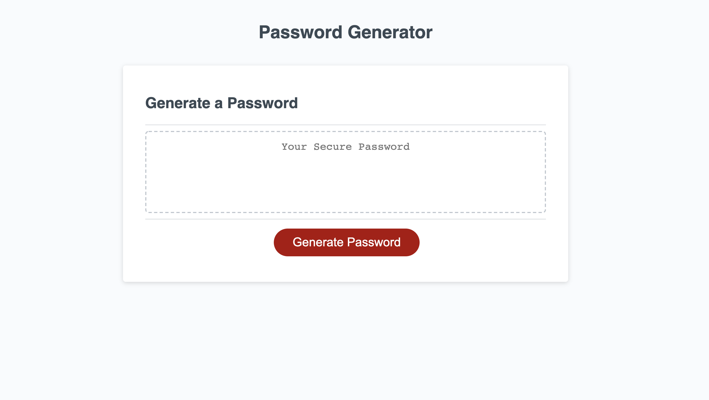

# password-generator
This password generator is an assignment from UNC bootcamps!

In this assignment we were required to create a password chenerator that takes in the desired user characeter input (lowercase, uppercase, numbers, special characters, or all) and create a randomized password of their selected option.

It was a great exercise in looping through arrays, concatenation and joining of strings, and using different methods to access and define information. I also enjoyed learning how to use special characters. 

The completed application can be found here:
https://cparros.github.io/password-generator/

Image of application here:
